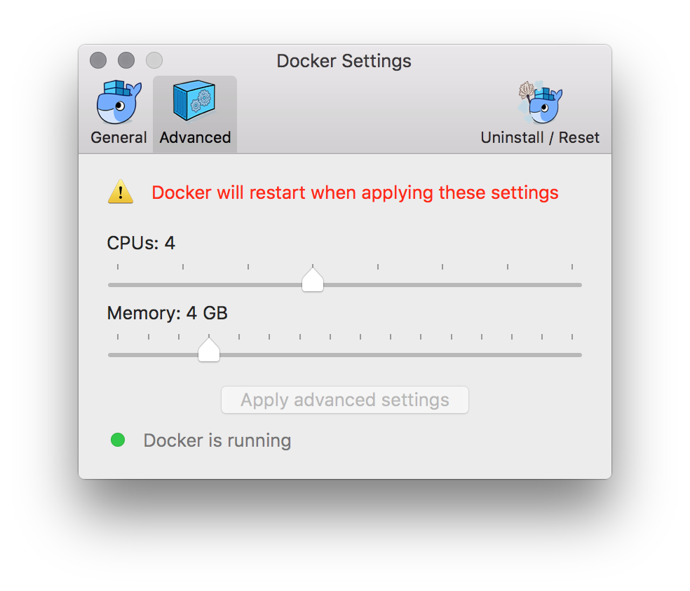

# Dockerfile for Valhalla

This [Dockerfile](https://docs.docker.com/engine/reference/builder/) provides an easy way to build and deploy Mapzen's Valhalla, an open-source routing engine, without configuring [the full Chef install](https://github.com/valhalla/chef-valhalla).

---

***Not ready to mess with Docker or Chef? Mapzen provides hosted versions of these services under the names Turn-by-Turn, Matrix, and Elevation. Sign up for a free developer key at https://mapzen.com/developers/***

---

Back to this Dockerfile: It defaults to using an OpenStreetMap extract of Trento, IT, but you can change this if you like, in the Dockerfile. Browse Mapzen's [Metro Extracts service](https://mapzen.com/metro-extracts/) for other regions, and copy the URL for a OSM PBF-formatted extract.

To build the Docker image issue:

```sh
./build.sh
```

To run instead issue:

```sh
./run-valhalla.sh
```

##### Tips for Running on a Mac

For easiest setup, use the Docker for Mac package, [currently available for beta testing](https://blog.docker.com/2016/03/docker-for-mac-windows-beta/).

Increase resources available to Docker to at least 4 CPU cores and 4Gb RAM:  

If your container can't connect to github.com to checkout libraries, you may need to edit your `/etc/resolve.conf`. For example, set your Mac WiFi to use [Google's public DNS servers](https://developers.google.com/speed/public-dns/), as well as a local router:

```sh
sudo networksetup -setdnsservers Wi-Fi 8.8.8.8 8.8.4.4 192.168.1.254
```

##### Good to have in future:

- A facility to load in a running container multiple OSM extracts.
